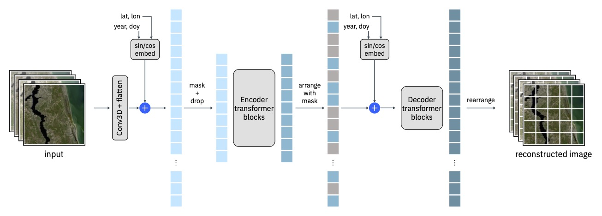
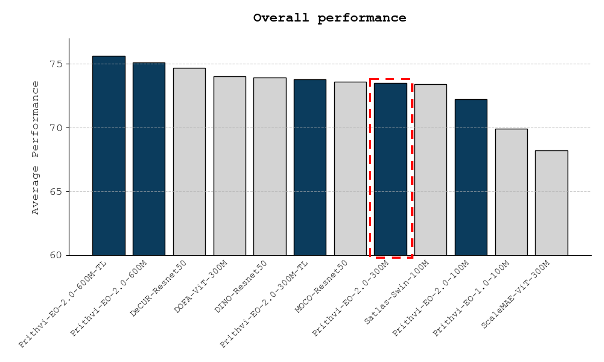

# Prithvi-EO-2.0

Prithvi-EO-2.0 is the second generation EO foundation model jointly developed by IBM, NASA, and Jülich Supercomputing Centre.

## Architecture Overview

Prithvi-EO-2.0 is based on the ViT architecture, pre-trained using a masked autoencoder (MAE) approach, with two major modifications as shown in the figure below. First, we introduce a random dropout mechanism that completely removes different bands before the patch embeddings, with the aim of improving the ability of the model to deal with missingness of data. Second, we make modifications to support inputs with temporal and multi-spectral characteristics. 



Our main modifications to the ViT architecture are the 3D positional embedding and the 3D patch embedding, which are required to deal with spatiotemporal data. We have also included metadata and process metadata about the actual geolocation (e.g. latitude and longitude) and date (i.e. year and day-of-year ranging 1-365). This is done by adding biases that are calculated via 2D sine-cosine positional encoding and added to the 3D positional embeddings and 3D patch embeddings via a learned weighted sum (i.e. the weight given is a parameter learned during pretraining). Since this metadata is often not available, we pretrained Prithvi-EO-2.0 allowing for this to be absent via a dropout.

## Pre-trained Models

| Model | Details | Weights                                                                                                                                                                    |
| ------------- | ------------- |----------------------------------------------------------------------------------------------------------------------------------------------------------------------------|
|Prithvi-EO-2.0-300M   | Pretrained 300M parameter model  | [https://huggingface.co/ibm-nasa-geospatial/Prithvi-EO-2.0-300M](https://huggingface.co/ibm-nasa-geospatial/Prithvi-EO-2.0-300M)                                           |
|Prithvi-EO-2.0-300M-TL   | Pretrained 300M parameter model with temporal and location embeddings | [https://huggingface.co/ibm-nasa-geospatial/Prithvi-EO-2.0-300M-TL](https://huggingface.co/ibm-nasa-geospatial/Prithvi-EO-2.0-300M-TL) |
|Prithvi-EO-2.0-600M   | Pretrained 600M parameter model  | [https://huggingface.co/ibm-nasa-geospatial/Prithvi-EO-2.0-600M](https://huggingface.co/ibm-nasa-geospatial/Prithvi-EO-2.0-600M) |                                          |
|Prithvi-EO-2.0-600M-TL   | Pretrained 600M parameter model with temporal and location embeddings | [https://huggingface.co/ibm-nasa-geospatial/Prithvi-EO-2.0-600M-TL](https://huggingface.co/ibm-nasa-geospatial/Prithvi-EO-2.0-600M-TL) |

The models were pre-trained at the Julich Supercomputing Center with NASA's HLS V2 product (30m granularity) using 4.2M samples with six bands in the following order: Blue, Green, Red, Narrow NIR, SWIR, SWIR 2.

## Benchmarking
The model was benchmarked on GEO-Bench across 12 different earth observation classification and segmentation tasks at different resolutions against some of the most popular geospatial foundation models. Below the average score across all GEO-Bench tasks is shown.



## Demo and inference
We provide a **demo** running Prithvi-EO-2.0-300M-TL [here](https://huggingface.co/spaces/ibm-nasa-geospatial/Prithvi-EO-2.0-Demo). 

There is also an inference script (`inference.py`) that allows to run the image reconstruction on a set of HLS images assumed to be from the same location at different timestamps (see example below). These should be provided in chronological order in geotiff format, including the channels described above (Blue, Green, Red, Narrow NIR, SWIR 1, SWIR 2) in reflectance units.

```
python inference.py --data_files t1.tif t2.tif t3.tif t4.tif --input_indices <optional, space separated 0-based indices of the six Prithvi channels in your input>
```

## Finetuning

You can finetune the model using [TerraTorch](https://github.com/IBM/terratorch).

### Feedback

Your feedback is invaluable to us. If you have any feedback about the model, please feel free to share it with us. You can do this by starting a discussion in this HF repository or submitting an issue to [TerraTorch](https://github.com/IBM/terratorch) on GitHub.

### Citation

If this model helped your research, please cite `Prithvi-EO-2.0` in your publications. Here are two BibTeX entries as examples:

```
@article{Prithvi-EO-2-preprint,
    author          = {},
    title           = {{Title}},
    journal         = {arxiv},
    year            = {2024}
}
```
