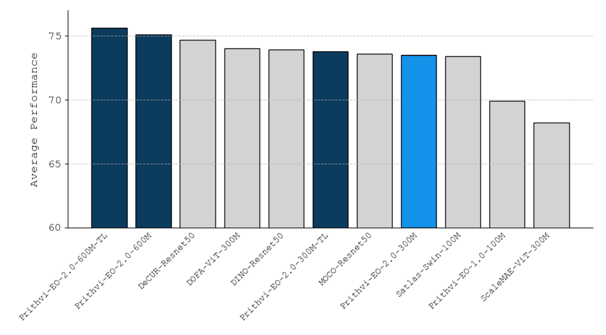

# Prithvi-EO-2.0

Prithvi-EO-2.0 is the second generation EO foundation model jointly developed by IBM, NASA, and Jülich Supercomputing Centre.

## Architecture Overview

Prithvi-EO-2.0 is based on the ViT architecture, pretrained using a masked autoencoder (MAE) approach, with two major modifications as shown in the figure below.


First, we replaced the 2D patch embeddings and 2D positional embeddings with 3D versions to support inputs with spatiotemporal characteristics, i.e., a sequence of T images of size (H, W). Our 3D patch embeddings consist of a 3D convolutional layer, dividing the 3D input into non-overlapping cubes of size (t, h, w) for time, height, and width dimensions, respectively. For the 3D positional encodings, we first generate 1D sin/cos encodings individually for each dimension and then combine them together into a single, 3D positional encoding.

Second, we considered geolocation (center latitude and longitude) and date of acquisition (year and day-of-year ranging 1-365) in the pretraining of the TL model versions. Both encoder and decoder receive time and location information for each sample and encodes them independently using 2D sin/cos encoding. They are added to the embedded tokens via a weighted sum with learned weights: one for time and one for location and separate weights for encoder and decoder. Since this metadata is often not available, we added a drop mechanism during pretraining that randomly drops the geolocation and/or the temporal data to help the model learn how to handle the absence of this information.

## Pre-trained Models

| Model | Details | Weights                                                                                                                                                                    |
| ------------- | ------------- |----------------------------------------------------------------------------------------------------------------------------------------------------------------------------|
|Prithvi-EO-2.0-300M   | Pretrained 300M parameter model  | [https://huggingface.co/ibm-nasa-geospatial/Prithvi-EO-2.0-300M](https://huggingface.co/ibm-nasa-geospatial/Prithvi-EO-2.0-300M)                                           |
|Prithvi-EO-2.0-300M-TL   | Pretrained 300M parameter model with temporal and location embeddings | [https://huggingface.co/ibm-nasa-geospatial/Prithvi-EO-2.0-300M-TL](https://huggingface.co/ibm-nasa-geospatial/Prithvi-EO-2.0-300M-TL) |
|Prithvi-EO-2.0-600M   | Pretrained 600M parameter model  | [https://huggingface.co/ibm-nasa-geospatial/Prithvi-EO-2.0-600M](https://huggingface.co/ibm-nasa-geospatial/Prithvi-EO-2.0-600M) |                                          |
|Prithvi-EO-2.0-600M-TL   | Pretrained 600M parameter model with temporal and location embeddings | [https://huggingface.co/ibm-nasa-geospatial/Prithvi-EO-2.0-600M-TL](https://huggingface.co/ibm-nasa-geospatial/Prithvi-EO-2.0-600M-TL) |

The models were pre-trained at the Jülich Supercomputing Centre with NASA's HLS V2 product (30m granularity) using 4.2M samples with six bands in the following order: Blue, Green, Red, Narrow NIR, SWIR, SWIR 2.

## Benchmarking
We validated the Prithvi-EO-2.0 models through extensive experiments using [GEO-bench](https://github.com/ServiceNow/geo-bench). Prithvi-EO-2.0-600M-TL outperforms the previous Prithvi-EO model by 8% across a range of tasks. It also outperforms six other geospatial foundation models when benchmarked on remote sensing tasks from different domains and resolutions (i.e. from 0.1m to 15m).



## Demo and inference
We provide a **demo** running Prithvi-EO-2.0-300M-TL [here](https://huggingface.co/spaces/ibm-nasa-geospatial/Prithvi-EO-2.0-Demo). 

There is also an inference script (`inference.py`) that allows to run the image reconstruction on a set of HLS images assumed to be from the same location at different timestamps (see example below). These should be provided in chronological order in geotiff format, including the channels described above (Blue, Green, Red, Narrow NIR, SWIR 1, SWIR 2) in reflectance units.

```
python inference.py --data_files t1.tif t2.tif t3.tif t4.tif --input_indices <optional, space separated 0-based indices of the six Prithvi channels in your input>
```

## Finetuning

You can finetune the model using [TerraTorch](https://github.com/IBM/terratorch). Examples of configs and notebooks are provided in the project repository: [github.com/NASA-IMPACT/Prithvi-EO-2.0](https://github.com/NASA-IMPACT/Prithvi-EO-2.0#fine-tuning).

### Feedback

Your feedback is invaluable to us. If you have any feedback about the model, please feel free to share it with us. You can do this by starting a discussion in this HF repository or submitting an issue to [TerraTorch](https://github.com/IBM/terratorch) on GitHub.

### Citation

If this model helped your research, please cite [Prithvi-EO-2.0](https://arxiv.org/abs/2412.02732) in your publications.

```
@article{Prithvi-EO-V2-preprint,    
    author          = {Szwarcman, Daniela and Roy, Sujit and Fraccaro, Paolo and Gíslason, Þorsteinn Elí and Blumenstiel, Benedikt and Ghosal, Rinki and de Oliveira, Pedro Henrique and de Sousa Almeida, João Lucas and Sedona, Rocco and Kang, Yanghui and Chakraborty, Srija and Wang, Sizhe and Kumar, Ankur and Truong, Myscon and Godwin, Denys and Lee, Hyunho and Hsu, Chia-Yu and Akbari Asanjan, Ata and Mujeci, Besart and Keenan, Trevor and Arévolo, Paulo and Li, Wenwen and Alemohammad, Hamed and Olofsson, Pontus and Hain, Christopher and Kennedy, Robert and Zadrozny, Bianca and Cavallaro, Gabriele and Watson, Campbell and Maskey, Manil and Ramachandran, Rahul and Bernabe Moreno, Juan},
    title           = {{Prithvi-EO-2.0: A Versatile Multi-Temporal Foundation Model for Earth Observation Applications}},
    journal         = {arXiv preprint arXiv:2412.02732},
    year            = {2024}
}
```
